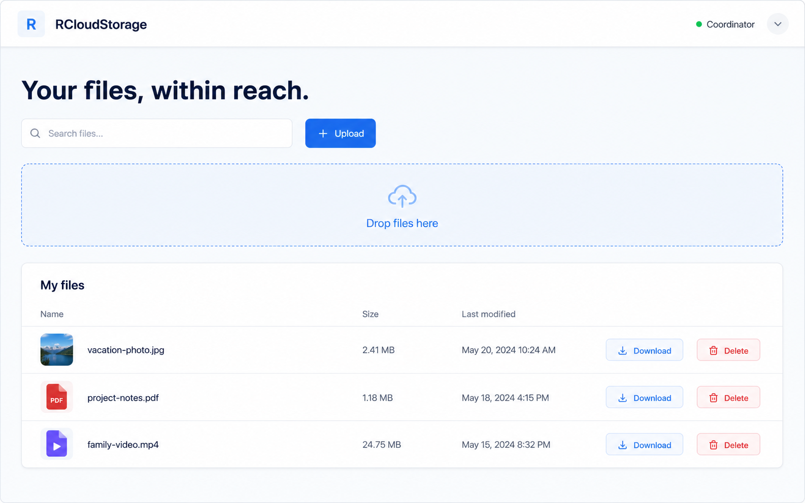

# RCloudStorage Frontend Portal

Mobile-first Next.js UI for the RCloudStorage **coordinator**. It provides a file library with upload, download, delete, search, drag-and-drop, and touch-friendly controls.

## Preview

The portal is designed mobile-first: its file list and upload controls remain touch-friendly on small screens, while the wider dashboard expands into a full file-management workspace.

## Run locally

1. Start the RCloudStorage coordinator on `http://localhost:9000` (see its README).
2. Copy `.env.example` to `.env.local` if the coordinator uses another URL.
3. Run `npm install` and `npm run dev`.
4. Open `http://localhost:3000`.

The portal sends browser requests to its own `/api/storage/...` proxy, which forwards them to `RCLOUD_STORAGE_URL`. This avoids needing CORS headers on the current Go server and keeps the coordinator address off the client bundle.

## Current backend contract

The portal uses the current public coordinator API only:

- `GET /objects` — newline-delimited object keys
- `PUT /objects/{key}` — raw file upload
- `GET /objects/{key}` — file download
- `DELETE /objects/{key}` — removal

There is no authentication or public-share API in RCloudStorage yet, so this UI deliberately exposes neither. It must be deployed alongside the coordinator or behind the same trusted network boundary.
